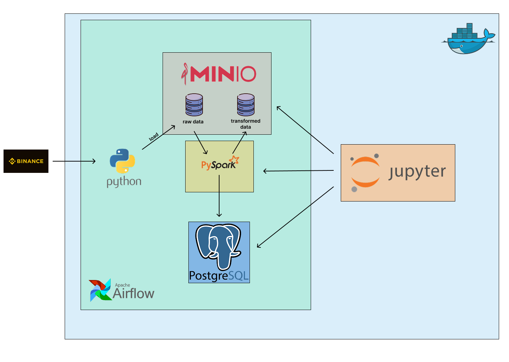

# Pet ETL porject

The ETL process for crypto data from Binance.

---
## Table of Contents

- [Pipeline schema](#Pipeline schema)
- [Installation](#installation)
- [Usage](#usage)
- [Configuration](#configuration)
- [Contributing](#contributing)
- [License](#license)
- [Contact](#contact)

---

## Pipeline schema

## Installation

### Step-by-step instructions on how to get your project running.

#### Clone repository 
```bash
git clone https://github.com/Basilius-B/pet_ETL.git
```
#### Build docker compose
``` bash
docker compose build
```
#### Run docker compose
-d = detached mode (runs in background).\
If you omit it, logs will stream in your terminal.
```bash
docker compose up -d
```
